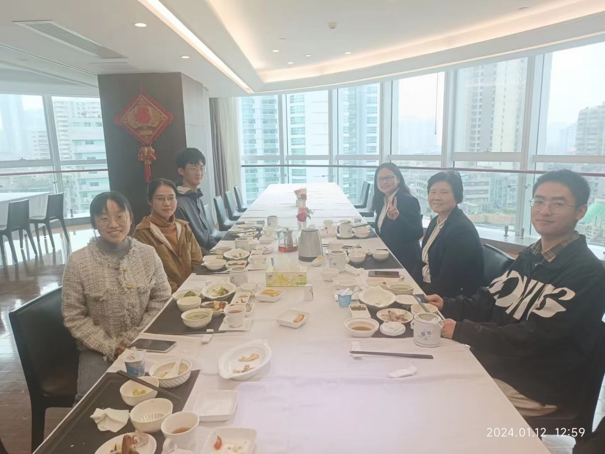
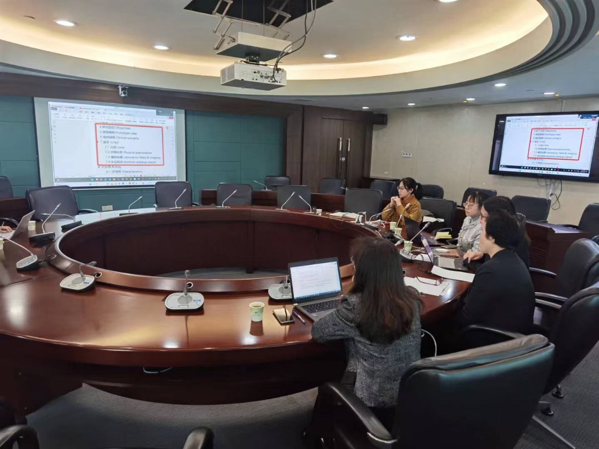
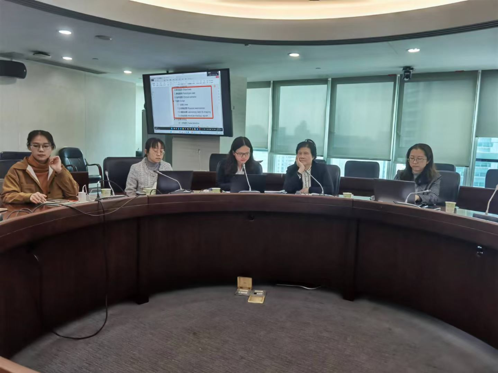

The formal launch of the **Bravery** project, which aims to conduct **Br**ief Verb**a**l Inter**v**ention to Address Inappropriate Pr**e**scriptions of Chinese Patent Medicines among Western P**r**actitioners in Primar**y** Health Care (*bravery*), has commenced. This initiative also constitutes the focal point of my doctoral research.

In Chinese primary healthcare institutions, especially among Western physicians in clinical practice, there is a common trend of prescribing Chinese Patent Medicines. However, the rational use of Chinese Patent Medicines requires support from Chinese Patent Medicines theory. Primary care Western physicians lack background knowledge in Chinese Patent Medicines, and the extensive prescription of Chinese Patent Medicines by them can easily lead to irrational drug use. This project aims to develop brief verbal interventions from the patient's perspective. It will conduct a randomized controlled trial with 672 sample visits in Guangzhou and Shaoyang areas to encourage primary care Western physicians to use Chinese Patent Medicines rationally.

This morning, I, along with student assistants HuanYu and Yantao, visited the Guangdong Provincial Hospital to collaborate with Director Lin Lin from the Respiratory Department. Director Lin has nearly 40 years of clinical experience and has accumulated a wealth of experience in clinical research and evidence-based medicine. We are honored to collaborate with Director Lin's team. In this project, the provincial Chinese Patent Medicines team is responsible for case development and prescription reviews, while we are responsible for research design and project execution. We look forward to efficient collaboration and providing high-quality evidence on the rational use of Chinese Patent Medicines for primary healthcare institutions. Additionally, I hope to document every precious moment of this research project as coordinates for future reflection.

 
 

   

 
 

   

 
 

   

 
 

   

 
 
